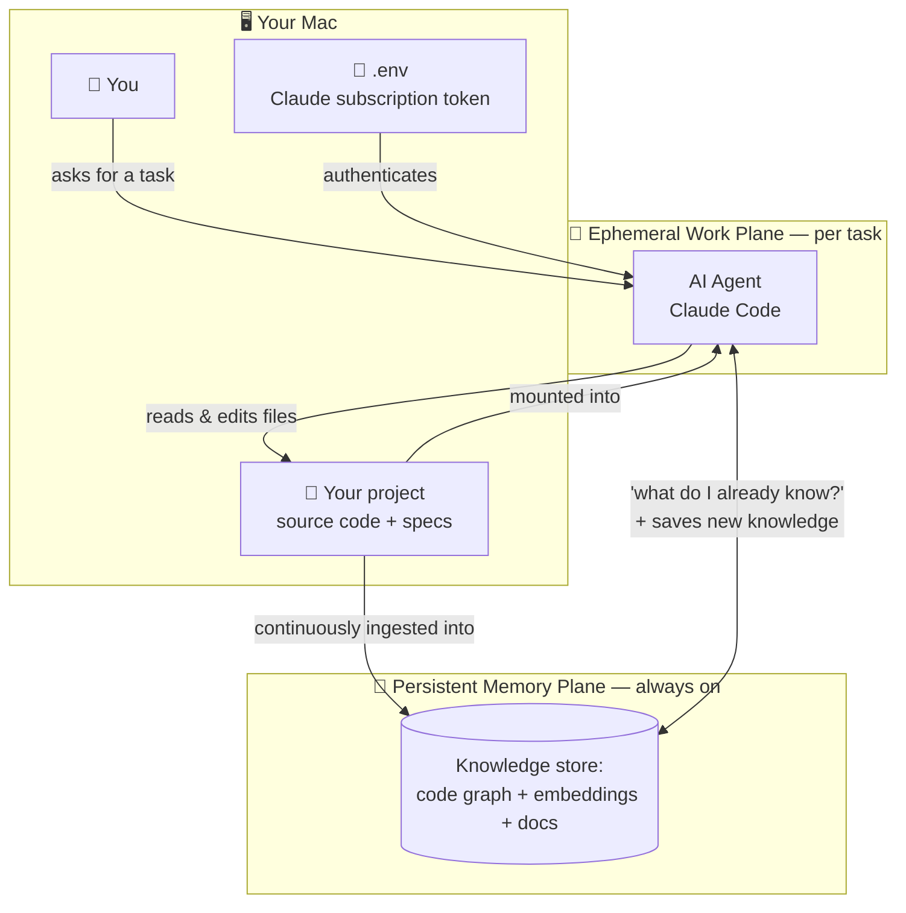
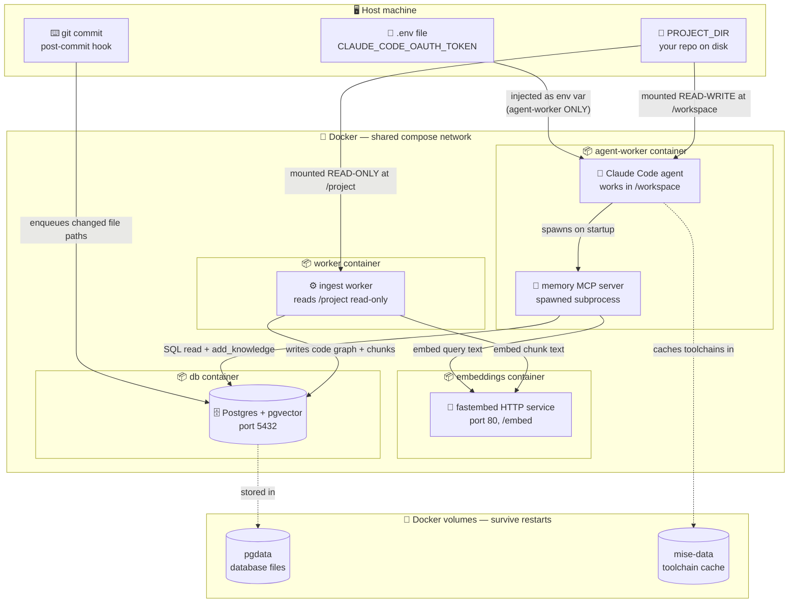
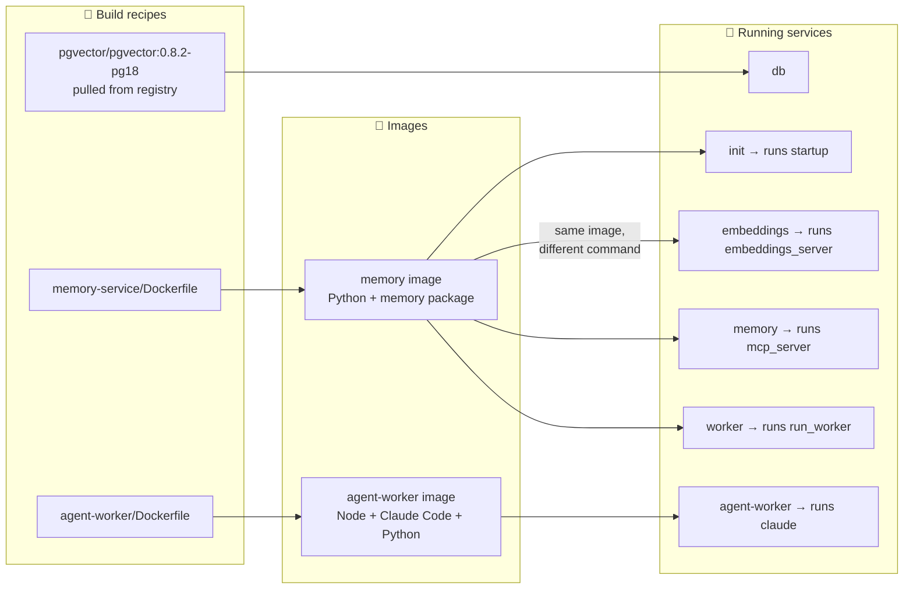
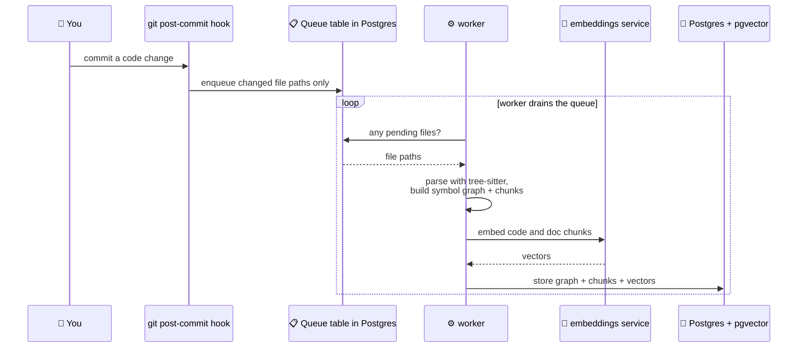
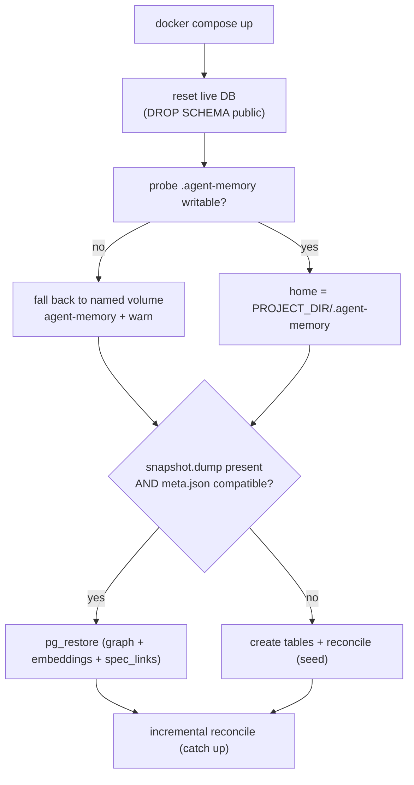
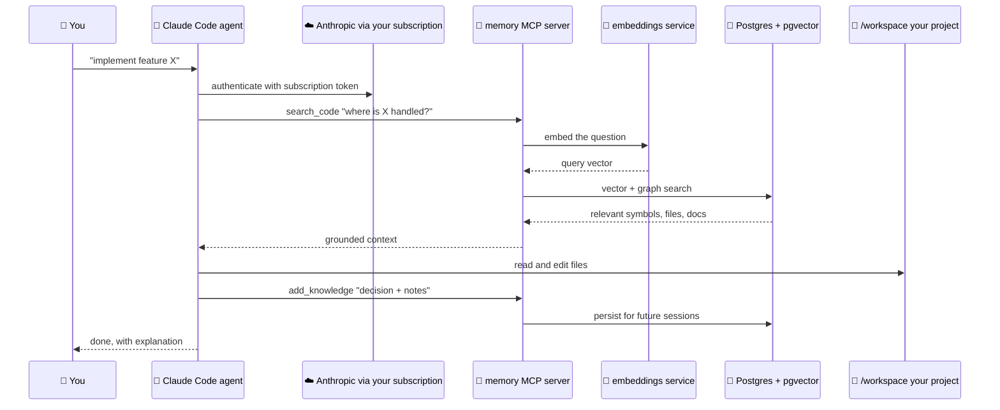
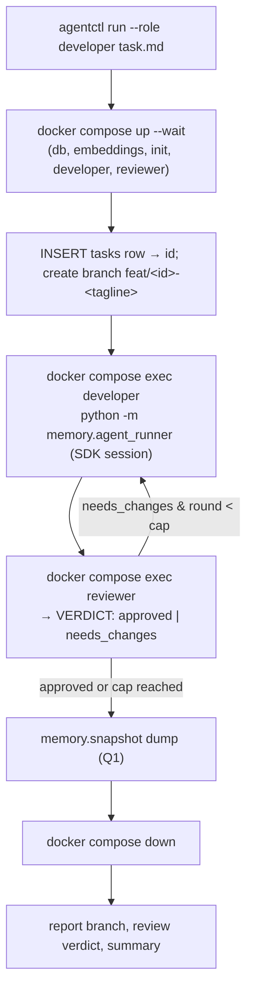

# Architecture

This document explains how the agentic-development environment works — its
inputs and outputs, what is shared across containers, where the agent works,
where data is stored, and how the secret (your Claude subscription token) is
passed. It starts with a plain-English mental model, then drills into runtime
topology, the image build, and the two main data flows.

## Why this exists

The environment solves three problems that get worse as a project grows
(see [GOAL.md], which is intentionally untracked):

1. **No shared memory across agent sessions** — each session starts blind.
2. **Wasted context** re-supplying project information every session.
3. **Hallucinations** as historical knowledge fades.

It fixes them with a persistent, always-on **memory** (a map of your code plus
searchable embeddings) that AI agents consult — and write back to — instead of
guessing.

## The 30-second mental model

The system has **two halves**:

- **🧠 A persistent "memory" half** that is always on. It holds everything known
  about your project — a structure graph of the code plus semantic embeddings —
  in a database that survives restarts.
- **🤖 An ephemeral "agent" half** that you spin up to do a task. The AI agent
  (Claude Code) works on your project mounted into the container, and it
  *consults the memory* instead of guessing.

## Diagram 1 — Runtime topology (what runs where, what is shared)

Every container, the volumes that persist data, the shared network, and how the
secret is passed.

**How to read it:**

- **Shared across containers:** the **Postgres database** (worker writes, agent
  reads) and the **embeddings service** (both turn text into vectors). Services
  find each other by name over the shared Docker network.
- **Where the database lives:** in the `pgdata` volume — *not* inside the
  container — so rebuilding containers never loses memory.
- **Where the agent works:** in `/workspace`, your real project folder mounted
  read-write, so its edits land on your disk. The worker gets the *same* folder
  read-only at `/project`, so ingestion can never modify your code.
- **How the secret is passed:** the subscription token lives only in `.env`
  (gitignored) and is injected as an env var into **only** the agent-worker
  container — the database, worker, and embeddings never see it.
- **Per-project memory:** a one-shot `init` service (same memory image) runs
  `python -m memory.startup /project` before the worker, restoring or seeding
  the DB from `PROJECT_DIR/.agent-memory/snapshot.dump`. An `agent-memory`
  named volume is the fallback when `.agent-memory/` is not writable.
- **Orchestration (Q2):** `agentctl` (host) drives the stack; warm `developer`
  and `reviewer` containers (same agent-worker image, role-pinned, `sleep
  infinity`) receive a fresh Claude Agent SDK session per task via `docker
  compose exec`. Coordination state lives in the `tasks` table.

## Diagram 2 — How the images are built (one recipe, many roles)

A key design choice: **one Dockerfile produces one image that runs as three
services** (just with different start commands). Only the agent image and the
pulled database image are separate.

## Diagram 3 — Data flow A: keeping memory fresh (ingestion)

When code changes, memory updates itself. The git hook only *records* what
changed; the worker does the heavy lifting in the background.

Notes:

- The worker also runs as a one-shot **reconcile** (full scan) to seed a project
  or recover from drift. Both paths share `memory.discovery`, which skips
  dependency/build directories (`.venv`, `node_modules`, `.git`, …) and ingests
  every supported language.
- Supported today: Python and TypeScript/JavaScript for the code graph;
  Markdown for docs.

## Diagram 3b — Startup: per-project snapshot restore-or-seed

Memory is **per-project**, co-located with the source under a self-ignoring
`PROJECT_DIR/.agent-memory/` (a `.gitignore` of `*`), and snapshot-able. A
one-shot `init` service runs before the steady worker:

- **Isolation:** the live Postgres volume is reset on every start, so the
  on-disk snapshot — not whatever the global volume held — is the source of
  truth. Point `PROJECT_DIR` at a different repo and you get that repo's memory.
- **Derivable vs irreplaceable:** the structure graph + chunks + embeddings are
  rebuildable by `reconcile`; agent-authored `spec_links` (`add_knowledge`) are
  not, so the snapshot protects them. A corrupt/incompatible snapshot degrades
  to a fresh seed — working-but-loud, never working-but-lossy.
- **Explicit save:** `python -m memory.snapshot dump PROJECT_DIR/.agent-memory`
  (atomic; exits non-zero on failure) is called before teardown. The
  compatibility guard (`meta.json`: schema version, pg major, code/doc model+dim)
  refuses a restore that would mix embedding dimensions.

## Diagram 4 — Data flow B: the agent doing work (grounded, not guessing)

Before acting, the agent asks memory what is already known, then writes new
decisions back for future sessions.

The MCP server exposes: `search_code`, `search_docs`, `get_symbol`,
`impact_of`, `spec_for`, and `add_knowledge`.

## Diagram 5 — Single-task orchestration (Q2 increment 1)

`agentctl run --role developer path/to/task.md` drives one task end-to-end. A
host-side Python orchestrator brings the stack up (Q1 `init` restores/seeds
memory), runs the task on a dedicated `feat/<id>-<tagline>` branch through a
developer agent, has a reviewer agent check it, auto-iterates up to a cap
(default 2), then dumps the snapshot and tears down.

- **Coordination is through the `tasks` table** (in the memory Postgres, so it is
  snapshotted by Q1) plus the task branch — agents update their row; the
  orchestrator reads it back between steps.
- **The orchestrator is plain host-side Python**, not an LLM. Agents run as
  Claude Agent SDK sessions inside warm per-role containers.
- **Never lossy:** the snapshot `dump` always runs before `down`; if it fails,
  the stack stays up and the failure is surfaced.

## Glossary for a non-technical reader

- **Container** — a lightweight isolated mini-computer running one job.
- **Image** — the frozen template a container is started from.
- **Volume** — storage that lives outside containers, so data survives rebuilds
  (the **database** and **toolchain cache** live here).
- **Mount** — sharing a host folder into a container; your project is mounted so
  the agent edits the *real* files.
- **MCP server** — the adapter that lets the agent call memory as tools
  (`search_code`, `add_knowledge`, …).
- **Embeddings** — turning text into numbers so "find similar code/docs" works by
  meaning, not keywords.

[GOAL.md]: ../GOAL.md
